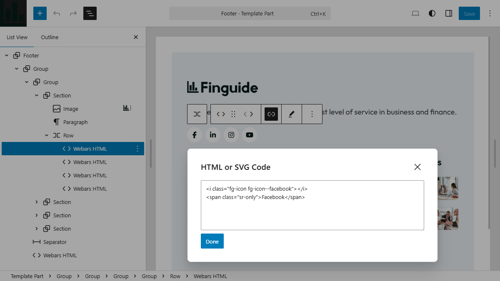

# Webars HTML Block

**Webars HTML** is a custom Gutenberg block that allows you to insert raw HTML or SVG markup
directly into the editor. It produces identical, minimalist output in both the editor
and on the frontend — ensuring a true WYSIWYG experience.


## Screenshots

#### Editor View

<kbd>
  
</kbd>

<div>&nbsp;</div>

#### Live Website

<kbd>
  
</kbd>


## Problem

This block was created to address real limitations encountered in production environments.


### Native HTML Block

* Displays raw HTML instead of rendered output in the editor
* Breaks visual flow during page building
* Makes layout composition harder, especially for UI elements


### Existing Solutions

Nick Diego's [Icon Block](https://wordpress.org/plugins/icon-block/) improves the experience
but does not fully resolve these issues:

* Restricted to SVG only, with no support for other HTML markup
* Mismatch between editor and frontend output, making CSS styling unreliable


## Features

* Generates identical markup in both the editor and on the frontend
* Supports any HTML (not limited to SVG)
* Renders output instead of raw code in the editor
* Provides structure only, with no built-in styling
* Performs basic validation by matching opening and closing tags


## Markup

The block generates minimal, predictable markup.
The optional link wrapper does not affect the overall structure.

#### Without Link Wrapper

```html
<div class="wp-block-webars-html">
  <div class="webars-html__content">{content}</div>
</div>
```

#### With Link Wrapper

```html
<div class="wp-block-webars-html">
  <a class="webars-html__content">{content}</a>
</div>
```


## Use Cases

This block is especially useful for:

* Links styled as buttons with icons
* Lists with custom icon bullets
* Inline UI elements requiring precise markup control
* Any scenario where editor-frontend parity is critical